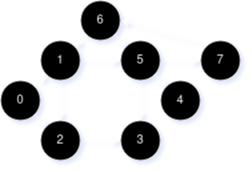

# Algorithms Comprehensive Exam (Spring 2023)
[< Back](../toc.md)

## Short Questions

1. ### Solve the following recurrences:

    * #### A. $T(n) = T(n - 2) + T(\frac{n}{2}) + n$
    * #### B. $T(n) = 2 \cdot T(n^{\frac{1}{2}}) + \lg_2(n)$

---

2. ### The utiliziation efficiency of a hash table depends heavily on its hashing function(s) employed. Describe with a diagram to illustrate how a multiplication method of hashing works on a machine with a word size of $w$ bits for a hash table with $2^p$ entries | $p \lt w$.

---

3. ### For any $n$-key B-tree of height $h$ and with a minimum node degree of $t \ge 2$, show that $h$ is not larger than $\log_t(\frac{n + 1}{2})$.

4. ### Follow Prim's algorithm to derive the Minimum Spanning Tree of the following graph, to root at $v_1$, and with the edge picked in each step indicated explicitly, like Step 1: $<v_1, v_2>$.

    

---

5. ### Show your construction of an optimal Huffman code for the set of 14 frequencies: $a:2, b:12, c:18, d:10, e:13, f:21, g:14, h:26, i:9, j:15, k:8, l:5, m:34, n:23$.

---

6. ### The following graph denotes a sequence of courses, with their dependencies on other courses shown, i.e., a directed edge from vertex $u$ in the graph to vertex $v$ implies that course $u$ must be taken before course $v$ can start. Apply DFS (depth-first search) for a topological sort, starting with vertex 0, to find an ordering of these courses compliant to shown dependencies. At each visited vertex, all of its outgoing edges are traversed in increasing order of their terminating vertex ID's. For example, at vertex 0, edge $<0, 1>$ is traversed before edge $<0, 2>$. Illustrate each step.

    

---

## Long Questions

1. ### Given the initial B-tree with $t = 2$...

    

    * #### A. Insert $L_1 | L \lt L_1 \lt M$
    * #### B. Delete $T$
    * #### C. Insert $F_2 | F \lt F_2 \lt G$
    * #### D. Delete $J$

---

2. ### Given a set of 4 keys, with the following probabilities, determine the cost and the structure of an optimal binary search tree (OBST), following the tabular, bottom-up method realized in the procedure of `OPTIMAL-BST` below to construct and fill $e[1:5, 0:4]$, $w[1:5, 0:4]$, and $root[1:4, 1:4]$.

    | $i$   | 0    | 1    | 2    | 3    | 4    |
    |:-----:|:----:|:----:|:----:|:----:|:----:|
    | $p_i$ |      | 0.12 | 0.15 | 0.13 | 0.20 |
    | $q_i$ | 0.10 | 0.03 | 0.02 | 0.08 | 0.17 |

    ### Construct and fill the 3 tables and show the OBST obtained.

    ```
    OPTIMAL-BST(p, q, n)
        let e[1:n + 1, 0:n], w[1:n + 1, 0:n], and root[1:n, 1:n] be new tables
        for i = 1 to n + 1
            e[i, i - 1] = q_{i - 1}
            w[i, i - 1] = q_{i - 1}
        for l = 1 to n
            for i = 1 to n - l + 1
                j = i + l - 1
                e[i, j] = infinity
                w[i, j] = w[i, j - 1] + p_j + q_j
                for r = i to j
                    t = e[i, r - 1] + e[r + 1, j] + w[i, j]
                    if t < e[i, j]
                        e[i, j] = t
                        root[i, j] = r
        return e and root
    ```

---

3. ### The Floyd-Warshall algorithm (FW) obtains all pairs of shortest paths in a weighted directed graph. Given the graph below, derive all distance matrices $D^k$ following FW so that the $d_{i, j}^n$ element of final matrix $D^n$ denotes $\delta(i, j)$ for every vertex pair $<i, j>$ for all $i, j \in {1, 2, 3, 4, 5}$.

    

---

4. ### Follow the Ford-Fulkerson algorithm to compute the max flow of the flow network given below, with the corresponding residual network at each step of the algorithm show explicitly.

    

---

5. ### The NP-completeness class contains a fraction of NP problems, which include all P problems.

    * #### A. How do you prove the very first NP-complete problem?
    * #### B. After NP-completeness probl;ems are proven, how do you show a new problems at hand to be NP-complete?

    ### The traveling-salesmen problem of a complete undirected weighted graph is NP-complete, and it has a 2-approximation solution in polynomial time given in the textbook.

    * #### C. Outline such an approximation solution.
    * #### D. Sketch a brief proof to demonstrate that such a solution satisfies 2-approximation.