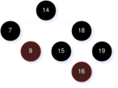
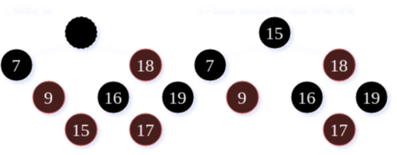
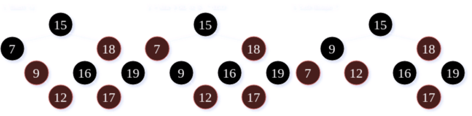
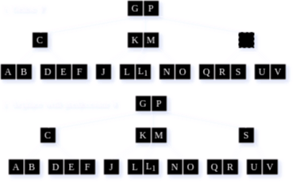
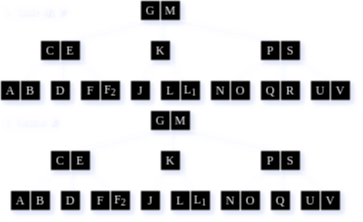
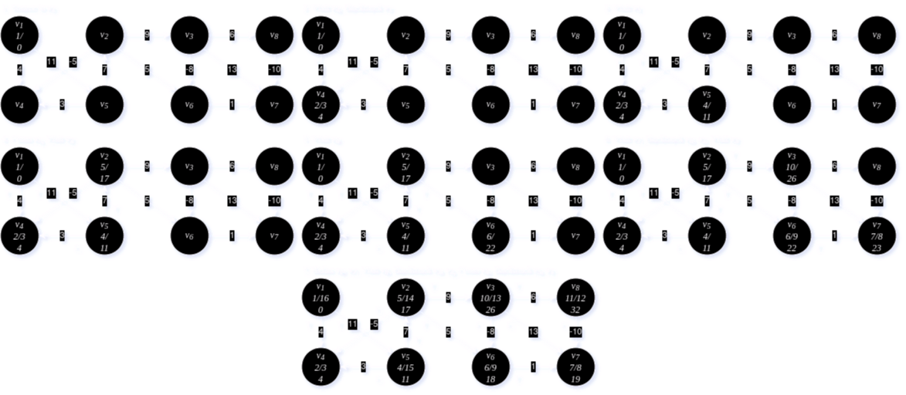
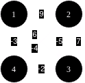
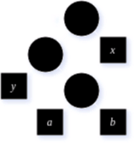

# CSCE 500 - Final Exam (Fall 2022)
[< Back](../toc.md)

1. **Solve $T(n)$ for the following two recurrences.**

    * A. **$T(n) = T(\frac{n}{8}) + T(\frac{n}{4}) + T(\frac{n}{2}) + cn$**

    * B. **$T(n) = 8\cdot T(\frac{n}{3}) + \Theta(n^2)$**

        Use master method case #3:

        Let $\alpha = 8$ and $\beta = 3$                    \
        $\implies n^{log_3(8)} \approx n^{1.893}$       \
        $\implies$ Polynomially smaller than $f(n^2)$   \
        $\therefore T(n) = 8\cdot T(\frac{n}{3}) + \Theta(n^2) \in \Theta(n^2)$

---

2. **Given the Red-Black (RB)-tree below...**

    

    **...show the resulting tree in sequence after:**

    * A. **Inserting 17**

        

    * B. **Deleting 14**

        

    * C. **Inserting 12**

        

---

3. Given the initial B-tree with minimum node degree $t=2$...

    

    ...show the results of:

    |       | Keys  | Children  |
    |:-----:|:-----:|:---------:|
    | Min   | 1     | 2         |
    | Max   | 3     | 4         |

    * A. **Inserting $L_1$ | $L \lt L_1 \lt M$**

        

    * B. **Deleting $T$**

        

    * C. **Inserting $F_2$ | $F \lt F_2 \lt G$**

        

    * D. **Deleting $R$**

        


---
4. **Given the matrix-chain multiplication problem for four matrices of size 30x12, 12x10, 10x12, 12x5, follow the tabular, bottom-up method in the procedure `MATRIX-CHAIN-ORDER` below to construct a table that keeps entry $m[i, j]$ for all $1 \le i$, $j \le 4$, where $m[i, j]$ denotes the minimum number of scalar multiplications needed to compute the result, and another table that keeps corresponding entry $s[i, j]$ for $1 \le i \le 3$ and $2 \le j \le 4$.**

    ```
    MATRIX-CHAIN-ORDER(p)
        n = p.length - 1
        let m[1...n, 1...n] and s[1...n-1, 2...n] be new tables
        for i = 1 to n
            m[i, j] = 0
        for l = 2 to n
            for i = 1 to n - l + 1
                j = i + l - 1
                m[i, j] = infinity
                for k = i to j - 1
                    q = m[i, k] + m[k + 1, j] + p_i-1 p_k p_j
                    if q < m[i, j]:
                        m[i, j] = q
                        s[i, j] = k
        return m and s
    ```

    * A. **Construct both tables, with their entry values shown.**

    * B. **Give the optimal parenthesized result, following $s$.**

    $$
    m[1,2] = 30 \cdot 12 \cdot 10 = 3600        \\
    m[2,3] = 12 \cdot 10 \cdot 12 = 1200        \\
    m[3,4] = 10 \cdot 12 \cdot 5  = 600         \\

    m[1,3] = min
        \begin{cases}
            m[1,1] + m[2,3] + (30 \cdot 12 \cdot 12) = 0 + 1200 + 4320 = \textbf{5520}  \\
            m[1,2] + m[3,3] + (30 \cdot 10 \cdot 12) = 3600 + 0 + 3600 = 7200           \\
        \end{cases}\\

    m[2,4] = min
        \begin{cases}
            m[2,2] + m[3,4] + (12 \cdot 10 \cdot 5) = 0 + 600 + 600 = \textbf{1200} \\
            m[2,3] + m[4,4] + (12 \cdot 12 \cdot 5) = 1200 + 0 + 720 = 1920         \\
        \end{cases}\\

    m[1,4] = min
        \begin{cases}
            m[1,1] + m[2,4] + (30 \cdot 12 \cdot 5) = 0 + 1200 + 1800 = \textbf{3000}   \\
            m[1,2] + m[3,4] + (30 \cdot 10 \cdot 5) = 3600 + 600 + 1500 = 5700          \\
            m[1,3] + m[4,4] + (30 \cdot 12 \cdot 5) = 5520 + 0 + 1800 = 7320            \\
        \end{cases}\\
    $$

    

---

5. **Derive the shortest paths from $v_1$ to all reachable nodes in the following graph, after following depth-first search (DFS) to sort all nodes in a topological order, Where DFS explores the outgoing links of each node in an increasing order to start with the lowest weighted link.**

    

    A. **Mark the type of every edge.**

    B. **Show the discovery and the finish times of each node after DFS.**

    C. **Sort all nodes in a topological order.**

    D. **Derive the shortest paths from $v_1$ to all other nodes in the graph via relaxation.**

    

    

---

6. **The Floyd-Warshall algorithm (FW) obtains all pairs of shortest paths in a weighted directed graph, with its pseudo code listed below. Csondier the following graph, with its vertices labeled 1, 2, 3, and 4.**

    ```
    FLOYD-WARSHALL(W, n)
        D^0 = W
        for k = 1 to n
            let D^k = d_{i,j}^k be a new n x n matrix
            for i = 1 to n
                for j = 1 to n
                    d_{i,j}^k = _______________________
        return D^n
    ```

    

    * A. **Derive all distance matrices $D^{(k)}$, for $0 \le k \le 4$, following $FW$ so that the $d_{i, j}^{(n)}$ element of the final matrix $D^{(n)}$ denotes $\delta(i, j)$ for every vertex pair $<i, j>$.**

        

    * B. **Show the missing statement in the pseudocode.**

        `d_{i,j}^k = min(d_{i,j}^{k - 1}, d_{i,k}^{k-1} + d_{k,j}^{k-1} + )`

        OR

        $D_{i,j}^k = min(D_{i,j}^{k-1}, D_{i,k}^{k-1} + D_{k,j}^{k-1})$

---

7. **Sketch a proof of the Lemma below, using the tree provided.**

    > Let C be an alphabet in which each character $c \in C$ has frequency $c.freq$. Let $x$ and $y$ be two characters in $C$ having the lowest frequencies. Then there exists an optimal prefix code for $C$ in which the codewords for $x$ and $y$ have the same length and differ only in the last bit.

    