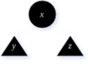
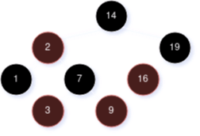
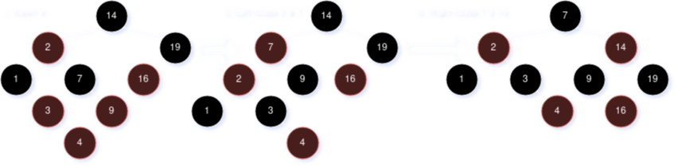
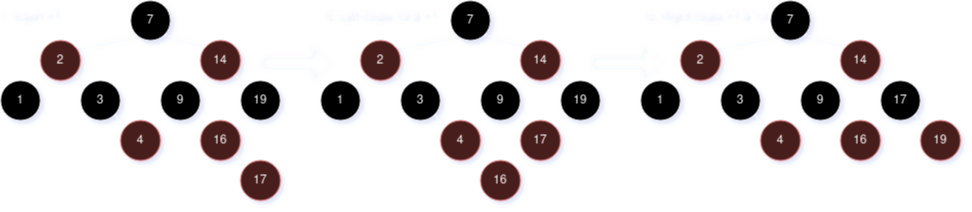

# CSCE 500 - Midterm Exam I (Fall 2024)
[< Back](../toc.md)

1. **Solve the recurrence relations:**

    * **A. $T_1(n) = 3 \cdot T_1(n^{\frac{1}{2}}) + \lg(n)$**

        $$
        Let~m = \lg(n), n = 2^m                                     \\
        T_1(2^m) = 3 \cdot T_1(2^{\frac{m}{2}}) + m                 \\
        Let~T_1(2^m) = S(m)                                         \\
        Therefore:                                                  \\
        S(m) = 3 \cdot S(\frac{m}{2}) + m                           \\
        m^{\lg_2(3)}~vs.~m', is~polynomially~larger                 \\
        Apply~case~1~of~Master~Method:                              \\
        S(m) = \Theta(m^{\lg_2(3)}) = \Theta((\lg n)^{\lg_2(3)})    \\
        T(2^m) = T(n) = \Theta((\lg n)^{\lg_2(3)})
        $$

    * **B. $T_2(n) = T_2(\frac{n}{3}) + T_2(\frac{2n}{3}) + n \cdot \lg(n)$**

---

2. **Is $n^3$ asymptotically-tight bound of**

    * **A. $(n^{2.99}) \cdot (\lg n)$**
    * **B. $\frac{n^3}{\lg \cdot \lg n}$**

---

3. **The utilization efficiency of a hash table depends heavily on its hashing function(s) employed. Describe with a diagram to illustrate how a multiplication method of hashing functions works on a machine with a word size of $w$ bits for a hash table with $2^p$ entries | $p \lt w$.**

    

---

4. **For an open-address hash table with load factor $\alpha = \frac{n}{m} \lt 1$, prove that:**

    * **A. The expected number of probes in an unsuccessful search under uniform hashing is at most $\frac{1}{1 - \alpha}$.**

        This question applies to Theorem 1 of Open-Address Hashing Analysis:

        Inserting an element into an open-address hash table with load factor $\alpha$ takes at most $\frac{1}{1 - \alpha}$ probes on an average under uniform hashing, because it has $(1 - \alpha)$ for 1 probe, plus probability $\alpha(1 - \alpha)$ to take 2 probes, plus probability $\alpha^2(1 - \alpha)$ to take 3 probes, etc., yielding $1 + \alpha + \alpha^2 + \alpha^3 + \dots = \frac{1}{1 - \alpha}$.

    * **B. The expected number of probes in a successful probe under uniform hashing is at most $(\frac{1}{\alpha}) \cdot \lg(1 - \alpha)^{-1}$. (Proof sketch suffices by explaining the probe count needed to locate existing keys)**

        This question applies to Theorem 2 of Open-Address Hashing Analysis:

        **NOTE**: Successful search for a key equals the sequence of inserting the key.

        $2^{nd}$ key insertion takes $\le \frac{1}{1 - (\frac{1}{m})}$ probes, on an average, when $\alpha$ is $\frac{1}{m}$.

        $3^{rd}$ key insertion takes $\le \frac{1}{1 - (\frac{2}{m})}$ probes, on an average, when $\alpha$ is $\frac{2}{m}$.

        ...

        $(i + 1)^{th}$ key takes $\le \frac{1}{1 - (\frac{i}{m})}$ probes.

        Average number of probes equals results over all $n$ keys inserted. This is because insertion and probes follow the same hash function, and we have: $\frac{1}{n} \Sigma_{i = 0}^{n - 1} \frac{1}{1 - \frac{i}{m}}$

---

5. **A binary search tree ($T$) is to be maintained following the in-order tree traversal order. Consider a sequence of arrival keys, {32, 27, 42, 14, 23, 33, 25, 34, 37, 28, 39}, to $T$ which is initially empty.**

    * **A. Show the resulting $T$ after inserting all arrival keys.**

        

    * **B. Show the resulting $T$ after its root node is deleted.**

        
    
    * **C. Show the resulting $T$ after deleting 27.**

        

---

6. **Show that a Red-Black (RB)-tree with $n$ internal nodes has the height of $h \le 2 \cdot \lg(n + 1)$.**

    

    Node $x$ defines a subtree with at least $2^{bh(x)} - 1$ internal nodes, proved by induction:

    $$
    |x| = |y| + |z| + 1                                 \\
    \ge (2^{bh(x) - 1} - 1) + (2^{bh(x) - 1} - 1) + 1   \\
    = 2 \cdot 2^{bh(x) - 1} - 1                         \\
    = 2^{bh(x)} - 1                                     \\
    $$

    Given $bh(x) \ge \frac{h(x)}{2}$, we have:

    $$
    n \ge 2^{bh(x)} - 1 \ge 2^{\frac{h(x)}{2}} - 1  \\
    n + 1 \ge 2^{\frac{h(x)}{2}}
    $$

    To get $\lg(n + 1) \ge \frac{h(x)}{2}$

---

7. **For the RB-tree below...**

    

    **...show the resulting tree in sequence after:**

    * **A. Inserting 4**

        

    * **B. Inserting 17**

        