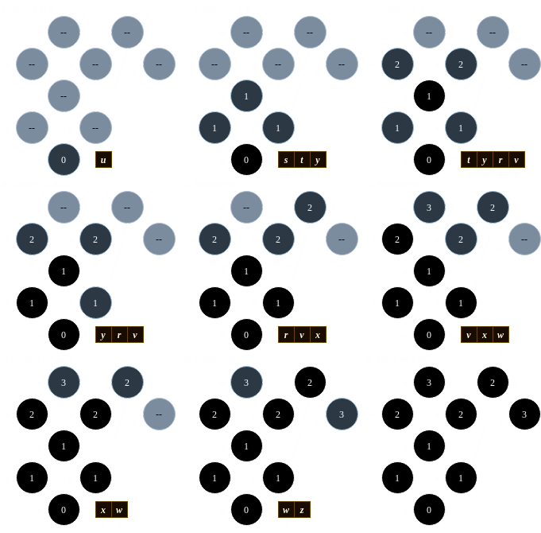
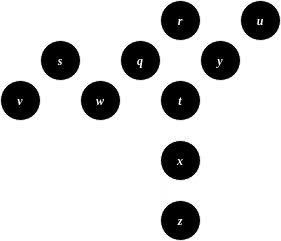

# <p style="text-align:center; font-family: Times New Roman">CSCE 500 - 001 - Assignment II</p>
<p style="text-align:center;">Gabriel C. Trahan - C00058009</p>

---

**NOTE**: Questions 2 - 8 are sourced from textbook: _Introduction to Algorithms_ $4^{th}$ _ed_

1. **Find an optimal parenthesization of a matrix chain product, with its sequence of dimensions equal to $<7, 12, 4, 11, 14, 5>$.**

    $$
    m[1,2] = 7 \cdot 12 \cdot 4 = 336      \\
    m[2,3] = 12 \cdot 4 \cdot 11 = 528     \\
    m[3,4] = 4 \cdot 11 \cdot 14 = 616     \\
    m[4,5] = 11 \cdot 14 \cdot 5 = 770
    $$

    $$
    m[1,3] = min
    \begin{cases}
        m[1,1] + m[2,3] + (7 \cdot 12 \cdot 11) = 0 + 528 + 924 = 1452          \\
        m[1,2] + m[3,3] + (7 \cdot 4 \cdot 11) = 336 + 0 + 308 = \textbf{644}   \\
    \end{cases}\\
    m[2,4] = min
    \begin{cases}
        m[2,2] + m[3,4] + (12 \cdot 4 \cdot 14) = 0 + 616 + 672 = \textbf{1288} \\
        m[2,3] + m[4,4] + (12 \cdot 11 \cdot 14) = 528 + 0 + 1848 = 2376        \\
    \end{cases}\\
    m[3,5] = min
    \begin{cases}
        m[3,3] + m[4,5] + (4 \cdot 11 \cdot 5) = 0 + 770 + 220 = 990            \\
        m[3,4] + m[5,5] + (4 \cdot 14 \cdot 5) = 616 + 0 + 280 = \textbf{896}   \\
    \end{cases}\\
    $$

    $$
    m[1,4] = min
    \begin{cases}
        m[1,1] + m[2,4] + (7 \cdot 12 \cdot 14) = 0 + 1288 + 1176 = 2464             \\
        m[1,2] + m[3,4] + (7 \cdot 4 \cdot 14) = 336 + 616 + 392 = \textbf{1344}    \\
        m[1,3] + m[4,4] + (7 \cdot 11 \cdot 14) = 644 + 0 + 1078 = 1722             \\
    \end{cases}\\
    m[2,5] = min
    \begin{cases}
        m[2,2] + m[3,5] + (12 \cdot 4 \cdot 5) = 0 + 896 + 240 = \textbf{1136}  \\
        m[2,3] + m[4,5] + (12 \cdot 11 \cdot 5) = 528 + 770 + 660 = 1958        \\
        m[2,4] + m[5,5] + (12 \cdot 14 \cdot 5) = 1288 + 0 + 840 = 2128         \\
    \end{cases}\\
    $$

    $$
    m[1,5] = min
    \begin{cases}
        m[1,1] + m[2,5] + (7 \cdot 12 \cdot 5) = 0 + 1136 + 420 = 1556          \\
        m[1,2] + m[3,5] + (7 \cdot 4 \cdot 5) = 336 + 896 + 140 = \textbf{1472} \\
        m[1,3] + m[4,5] + (7 \cdot 11 \cdot 5) = 644 + 770 + 385 = 1799         \\
        m[1,4] + m[5,5] + (7 \cdot 14 \cdot 5) = 1344 + 0 + 490 = 1834          \\
    \end{cases}
    $$

    <p align="center">
        
    </p>

    Optimal Parenthesization is: $((A_1 \cdot A_2) \cdot ((A_3 \cdot A_4) \cdot A_5))$

---

2. **As stated, in dynamic programming, you first solve the sub problems and then choose which of them to use in an optimal solution to the problem. Professor Capulet claims that she does not always need to solve all the sub problems in order to find an optimal solution. She suggests that she can find an optimal solution to the matrix-chain multiplication problem by always choosing the matrix $A_k$ at which to split the sub-product $A_i~A_{i + 1} \dots A_j$ (by selecting $k$ to minimize the quantity $p_{i - 1}p_kp_j$ before solving the sub problems). Find an instance of the matrix multiplication problem for which this greedy approach yields a suboptimal solution.**

    Consider the matrices provided in Problem 1, where the dimensions are:
    $$
    p_0, p_1, p_2, p_3, p_4, p_5 = <7, 12, 4, 11, 14, 5>
    $$

    In this scenario, Professor Capulet's theory can be disproved by contradiction:

    When solving for $m[3, 5]$, the minimum quantity of $p_{i-1}p_kp_j$ would be 220:
    
    $$
    \begin{align*}
        p_{i-1}p_kp_j &= min
        \begin{cases}
            (4 \cdot 11 \cdot 5) = \textbf{220} \\
            (4 \cdot 14 \cdot 5) = 280          \\
        \end{cases}
    \end{align*}
    $$

    However, after computing the rest of each of those equations, the contradiction is obvious, where despite minimizing $p_{i-1}p_kp_j$, the difference of $m[4,5] - m[3,4] = 770 - 616 = 154$ is greater than the difference of $(p_2 \cdot p_4 \cdot p_5) - (p_2 \cdot p_3 \cdot p_5) = 280 - 220 = 60$, which influences the outcome of the calculation of the optimal solution just as much, since the calculation is a sum of those components. 
    
    $$
    \begin{align*}
        m[3,5] &= min
        \begin{cases}
            m[3,3] + m[4,5] + (4 \cdot 11 \cdot 5) = 0 + 770 + 220 = 990            \\
            m[3,4] + m[5,5] + (4 \cdot 14 \cdot 5) = 616 + 0 + 280 = \textbf{896}   \\
        \end{cases}\\
    \end{align*}
    $$

    Therefore, this proves that one must not only minimize $p_{i-1}p_kp_j$, but also the optimal sub-parenthesization.

---

3. **Suppose that instead of always selecting the first activity to finish, you instead select the last activity to start that is compatible with all previously selected activities. Describe how this approach is a greedy algorithm, and prove that it yields an optimal solution. (Use the table of activities below for consideration)**

    <center>

    | $i$   | 1 | 2 | 3 | 4 | 5 | 6 | 7 | 8 | 9 | 10    | 11    |
    |:-----:|:-:|:-:|:-:|:-:|:-:|:-:|:-:|:-:|:-:|:-----:|:-----:|
    | $s_i$ | 1 | 3 | 0 | 5 | 3 | 5 | 6 | 7 | 8 | 2     | 12    |
    | $f_i$ | 4 | 5 | 6 | 7 | 9 | 9 | 10| 11| 12| 14    | 16    |
    
    </center>
    
    An activity selection algorithm that always selects the last activity to start would be implemented as such:

    ```
    GREEDY-ACTIVITY-SELECTOR(s, f, n)
        A = {a_n}
        k = n
        for m = n - 1 to 1
            if f[m] <= s[k]
                A = A UNION {a_m}
                k = m
        return A
    ```

    Where:
    * $s$ is start times
    * $f$ is finish times
    * $n$ is the number of activities

    In observing the algorithm, one can see that the method remains greedy, as any time an activity with a finish time smaller than the previous activity's start time is found, that activity is added to the optimal solution, \textit{before} exploring activities that may have even sooner finish times.

    This technique is effectively the same as choosing activities that finish first, if one were to imagine time being reversed:

    Let:
    * $A$ be a set of activities monotonically increasing by *start* times, such that $s_1 \le s_2 \le \dots \le s_n$.
    * $S_k$ be a non-empty sub-problem of $A$
    * $a_m$ be the activity in $S_k$ with the latest starting time
    * $A_k$ be a mazimum-size subset of mutually compatible activities of $S_k$
    * $a_j$ be the activity in $A_k$ with the latest starting time

    Then:
    * **Case 1, $a_j == a_m$**:
        
        Since $a_j \in A_k$, $a_j$ is in some maximum-size subset of mutually compatible activities of $S_k$.
    * **Case 2, $a_j \ne a_m$**:

        Set $A_k' = A_k - \{a_m\} + \{a_j\}$. Since $A_k$ is some maximum-size subset of mutually compatible activities $S_k$, then $f_1 \le f_2 \le \dots \le s_m$. Since $a_j$ and $a_m$ are both activities with the latest starting time in $S_k$, $s_m == s_j$. Then, we have that $f_1 \le f_2 \le \dots \le s_j$ and $|A_k'| = |A_k|$. Since $a_j \in A_j$, $a_j$ is in some maximum-size subset of the mutually compatible activities of $S_k$.

---

4. **Generalize Huffman's algorithm to ternary codewords (i.e., codewords using the symbols 0, 1, and 2), and prove that it yields optimal ternary codes.**

    Altering the radix by which codewords are produced by Huffman trees does not affect the optimality of variable-length codewords. Utilizing a ternary base of numbers (i.e., 0, 1, 2) will still produce a tree of characters/terms, where the highest frequency terms will be located at upper leaves of the tree, thereby having smaller codewords, and the lowest frequency terms will be located at the lower levels of the tree.

    ```
    HUFFMAN(C)
        n = |C|
        Q = C
        for i = 1 to n - 1
            allocate a new node z
            u = EXTRACT-MIN(Q)
            v = EXTRACT-MIN(Q)
            w = EXTRACT-MIN(Q)
            z.left = u
            z.center = v
            z.right = w
            z.freq = u.freq + v.freq + w.freq
            INSERT(Q, z)
        return EXTRACT-MIN(Q)
    ```

    Ultimately, altering the radix that the algorithm uses would not have any consequence that violates the Lemmas of Huffman codes. The time complexity of the algorithm remains the same, as the additional steps incur constant time only, thereby adding no polynomial complexity.

---

5. **Show the $d$ and $\pi$ values that result from running breadth-first search on the undirected graph below, using vertex $u$ as the source. Assume that neighbors of a vertex are visited in alphabetical order.**

<p align="center">
    
</p>

<p align="center">
    
</p>

<center>

|       | $r$   | $s$   | $t$   | $u$   | $v$   | $w$   | $x$   | $y$   | $z$   |
|:-----:|:-----:|:-----:|:-----:|:-----:|:-----:|:-----:|:-----:|:-----:|:-----:|
| $d$   | 2     | 1     | 1     | 0     | 2     | 3     | 2     | 1     | 3     |
| $\pi$ | $s$   | $u$   | $u$   | NIL   | $s$   | $r$   | $y$   | $u$   | $x$   |

</center>

---

6. **Show how depth-first search works on the graph below. Assume that the for loop of lines 5-7 of the DFS procedure considers the vertices in alphabetical order, and assume that each adjacency list is ordered alphabetically. Show the discovery and finish times for each vertex, and show the classification of each edge.**

<p align="center">
    
</p>

<p align="center">
    
</p>

---

7. **Run the Bellman-Ford algorithm on the directed graph below, using vertex $z$ as the source. In each pass, relax edges in the same order as in the figure, and show the $d$ and $\pi$ values after each pass. Now, change the weight of edge $(z, x)$ to 4 and run the algorithm again, using $s$ as the source.**

---

8. **Run Dijkstra's algorithm on the directed graph below, first using vertex $s$ as the source and then using vertex $z$ as the source. Show the $d$ and $\pi$ values and the vertices in set $S$ after each iteration of the while loop.**