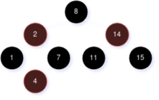
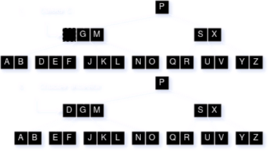

# CSCE 500 - Midterm Exam II (Fall 2022)

1. **For a given Balanced (B)-tree of height $h$ and minmum node degree of $t\le2$, what is the maximum number of keys held in such a tree?**

    $$
    n \le (2t-1) \Sigma_{i = 0}^h (2t)^i            \\
    n \le (2t-1) \cdot \frac{(2t)^h - 1}{2t - 1}    \\
    n \le (2t)^h - 1
    $$
 
2. **Given the Red-Black (RB) -tree below...**

    

    ...show the resulting tree in sequence after:

    * **A. Inserting 5**

        

    * **B. Deleting 2**

        

    * **C. Deleting 8**

        

3. **Given the initial B-Tree with a minimum node degree of $t=3$...**

    

    ...show the results of:

    * **A. Deleting $T$**

        

    * **B. Deleting $C$**

        

    * **C. Inserting $J_2$ | $J \lt J_2 \lt K$**

        

    * **D. Deleting $Y$**

        

 4. **Procedure `EXTENDED-BOTTOM-UP-CUT-ROD(P, N)` below exhibits low time complexity by utilizing two auziliary arrays, $r[0 \dots n]$ and $s[0 \dots n]$ to keep solutions for sub-problems obtained thus far, following the bottom-up approach.**

    ```
    Extended-Bottom-Up-Cut-Rod(p, n)
        let r[0...n] and s[0...n] be new arrays
        r[0] = 0
        for j = 1 to n
            q = -infinity
            for i = 1 to j
                if q < p[i] + r[j - i]
                    q = p[i] + r[j - i]
                    __________________
            r[j] = q
        return r and s
    ```

    * **A. Fill in the missing statement.**

        `s[j] = i` (Record the optimal cut-length found thus far)

    * **B. Give its time complexity.**

        $\Theta(n^2)$

    * **C. If `Extended-Bottom-Up-Cut-Rod(p, 8)` returns...**
    
        | $i$       | 0 | 1 | 2 | 3 | 4     | 5     | 6     | 7     | 8     |
        |:---------:|---|---|---|---|-------|-------|-------|-------|-------|
        | $r[i]$    | 0 | 1 | 5 | 8 | 10    | 13    | 17    | 18    | 22    |
        | $s[i]$    | 0 | 1 | 2 | 3 | 2     | 2     | 6     | 1     | 2     |

        **...show your resulting cut of the rod with 8 units in length for the maximum revenue.**

        