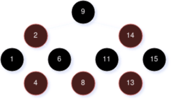
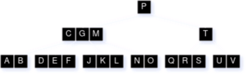

# CSCE 500 - Midterm Exam II (Fall 2024)
[< Back](../toc.md)

1. **A Red-Black (RB) tree is a binary search tree that satisfies five properties, including:**

    1. Every node is either red or black.
    2. The root [node] is black.
    3. Every leaf (NIL) is black.

    **What are the other two properties?**

---

2. **Given the RB-tree below...**

    

    **...show the resulting tree in sequence after:**

    * **A. Inserting 7**
    * **B. Deleting 9**
    * **C. Inserting 12**
    * **D. Deleting 6**

---

3. **For any $n$-key Balanced (B)-tree of height $h$ and with the minimum node degree $t \ge 2$ (i.e., number of keys in each non-root node), prove that $h \le \log_t(\frac{n + 1}{2})$.**

---

4. **For a given B-tree of height $h$ and with the minimum node degree of $t \ge 2$, what is the minimum number of keys held in such a B-tree?**

---

5. **Given the initial Btree with the minimum node degree of $t = 2$ below...**

    

    **...show the results of:**

    * **A. Inserting $L_1~|~L \lt L_1 \lt M$**
    * **B. Deleting $T$**
    * **C. Inserting $F_2~|~F \lt F_2 \lt G$**
    * **D. Deleting $J$**

---

6. **Procedure `EXTENDED-BOTTOM-UP-CUT-ROD(p, n)` below...

    ```
    EXTENDED-BOTTOM-UP-CUT-ROD(p, n)
        let r[0...n] and s[0...n] be new arrays
        r[0] = 0
        for j = 1 to n
            q = -infinity
            for i = 1 to j
                if q < p[i] + r[j - i]
                    q = p[i] + r[j - i]
                    s[j] = i
            r[j] = q
        return r and s
    ```

    ...exhibits low time complexity by utilizing two auziliary arrays $r[0 \dots n]$ and $s[0 \dots n]$ to keep solutions for sub-problems obtained thus far, following the bottom-up approach. If `EXTENDED-BOTTOM-UP-CUT-ROD(p, 10)` returns $r$ and $s$, based on $p_i$ as follows**:

    | $i$   | 1 | 2 | 3 | 4 | 5  | 6  | 7  | 8  | 9  | 10 |
    |:-----:|---|---|---|---|----|----|----|----|----|----|
    | $p_i$ | 1 | 5 | 8 | 9 | 10 | 17 | 17 | 20 | 24 | 30 |


    | $i$    | 0 | 1 | 2 | 3 | 4 | 5 | 6 | 7 | 8 | 9 | 10 |
    |:------:|---|---|---|---|---|---|---|---|---|---|----|
    | $r[i]$ | 0 | 1 | 5 | 8 | _ | _ | _ | _ | _ | _ | __ |
    | $s[i]$ | 0 | 1 | 2 | 3 | _ | _ | _ | _ | _ | _ | __ |

    * **A. Complete $r[0 \dots n]$ and $s[0 \dots n]$**
    * **B. Show your resulting cut of the rod with 10 units in length for the maximum revenue**